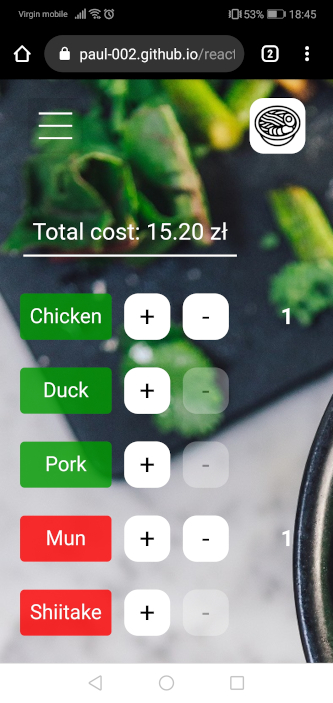
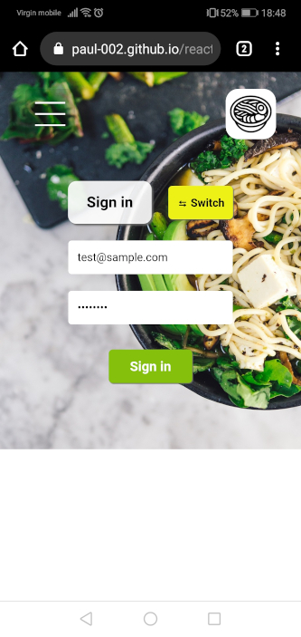
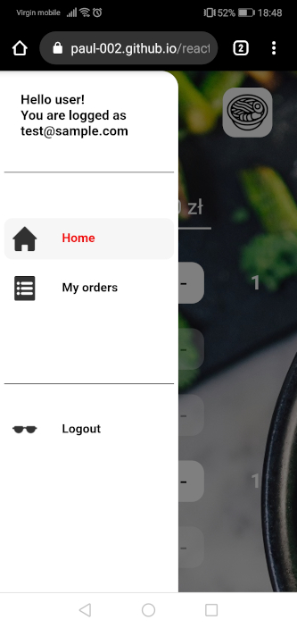
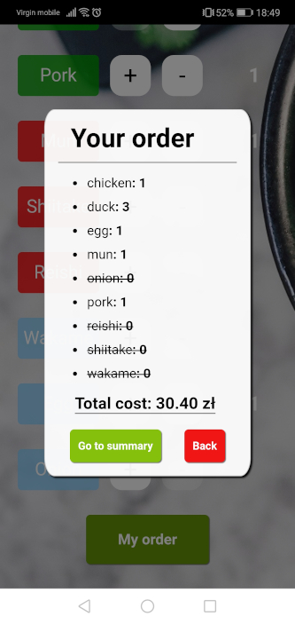
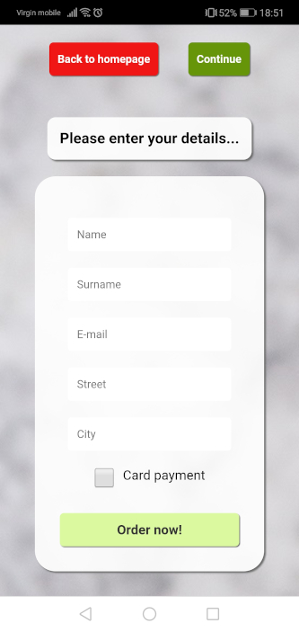
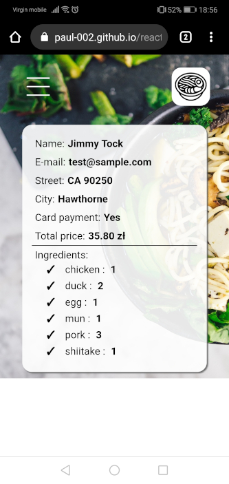

<h1 align="center">React-ramen-app</h1>

Compose your favorite ramen! \
Choose ingredients from the list, enter details in the contact form, and submit your order.
Want to check whether you have not mistaken the address, or entered the wrong phone number? Go to the tab "my orders" to check all the details.

## About project :clipboard:

- [General info](#General-info)
- [Technologies](#technologies)
- [Features](#features)
- [Screenshots](#Screenshots)
- [Setup](#setup)
- [Status](#status)
- [Inspiration](#Inspiration)
- [Contact](#contact)

## General info

Ramen-app is a SPA based on React.js library. For all HTTP requests is responsible Axios client. For backend support, I used the Google Firebase platform.

Components are styled by CSS Modules. RWD

The project helped me to understand basic features in React.js including lifecycle components and potential functionality of reusable components.

As the project grew, there was a need to use the Redux library to centrally manage the state of the application.
The project was branched and then merged to the master after making all necessary changes.

## Technologies

- React.js - ^16.8.3
- react-redux - ^7.0.3
- redux-thunk - ^2.3.0
- react-router - ^5.0.0
- axios - ^0.18.1
- webpack - ^4.28.3

## Features

List of ready features 🔥

- Routing with React Router,
- Firebase Authentication and user database,
- Redux state management,
- Navigating programmatically,
- Custom error handling.

## Screenshots

|              App menu              |              Authentication page               |
| :--------------------------------: | :--------------------------------------------: |
|  |  |

&nbsp;

|             Mobile nav              |                Checkout notification                |
| :---------------------------------: | :-------------------------------------------------: |
|  |  |

&nbsp;

|              User order form              |               Orders page               |
| :---------------------------------------: | :-------------------------------------: |
|  |  |

## Setup

Before you are ready to run **ramen-app** you will need additional software installed on your computer.

### Node.js

Version 10 or later is required. Download the Windows installer from the [Node.js downloads page.](https://nodejs.org/en/download/)

## Instalation

All commands need to be performed in either PowerShell or a Command Shell.

### 1. Clone the repository

`git clone https://github.com/Paul-002/react-ramen-app.git`

### 2. Enter the directory

`cd react-ramen-app`

### 3. Install all dependencies

`npm install`

### 4. Start the development server

`npm start`

### See the public [demo](https://paul-002.github.io/react-ramen-app/) of ramen-app!

## Status

Core functions are _no longer being developed_.

## Inspiration

This app is inspired by React course - The Complete Guide by [@mschwarzmueller](https://github.com/mschwarzmueller).

### Source of knowledge

- [React docs](https://en.reactjs.org/docs/getting-started.html)
- [Redux docs](https://redux.js.org/introduction/getting-started)
- [Firebase](https://firebase.google.com/docs/web/setup/)
- [Cris Esplin Blog](https://howtofirebase.com/)

...and many other websites like [youtube](https://www.youtube.com/), [egghead](https://egghead.io/)
(especially [Kent C. Dodds](https://github.com/kentcdodds) and [Dan Abramov](https://github.com/gaearon) tutorials)

## License

This project is licensed under the MIT License

## Contact

Created by :wave: [@Paul-002](https://github.com/Paul-002)
